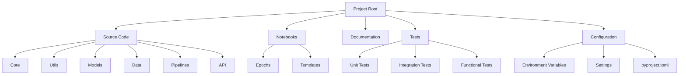
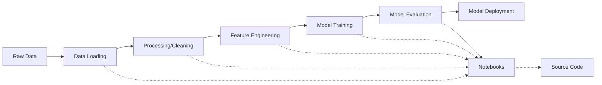
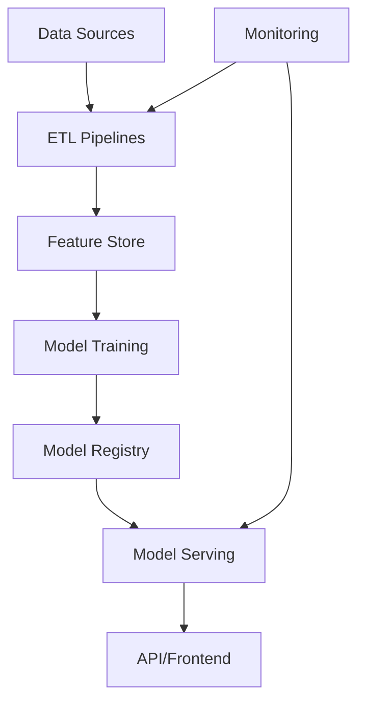

# Architecture Overview

This page provides a high-level overview of the template's architecture and design philosophy.

## Design Philosophy

The Data Science Template is built around several key design principles:

1. **Modularity**: Components are loosely coupled and can be used independently
2. **Progressive Disclosure**: Start with a simple structure that can be expanded as needed
3. **Convention over Configuration**: Sensible defaults with the ability to customize
4. **Reproducibility**: Support for tracking experiments and ensuring results can be reproduced
5. **Maintainability**: Emphasis on clean code, testing, and documentation

## Core Architecture

The template is organized into several key components:

### Key Components

1. **Source Code (`src/`)**: Contains the Python package with reusable code
2. **Notebooks (`notebooks/`)**: Jupyter notebooks organized by epochs
3. **Documentation (`docs/`)**: Project documentation using MkDocs
4. **Tests (`tests/`)**: Test suite for verifying functionality
5. **Configuration**: Settings, environment variables, and project metadata

## Extension Points

The template is designed to be extended in several ways:

1. **Optional Components**: Database, frontend, deployment tools
2. **Custom Commands**: Add new commands to the Angreal task system
3. **Additional Dependencies**: Add new dependencies for specific use cases
4. **Modified Structure**: Adapt the structure for specific project requirements

## Data Flow

The typical data flow in a project based on this template follows this pattern:

As exploratory work in notebooks stabilizes, it gets refactored into reusable code in the source package.

## Runtime Architecture

For deployed projects, the typical runtime architecture looks like this:

The template provides the foundation for building this architecture, with guidance on how to implement each component based on project requirements.
